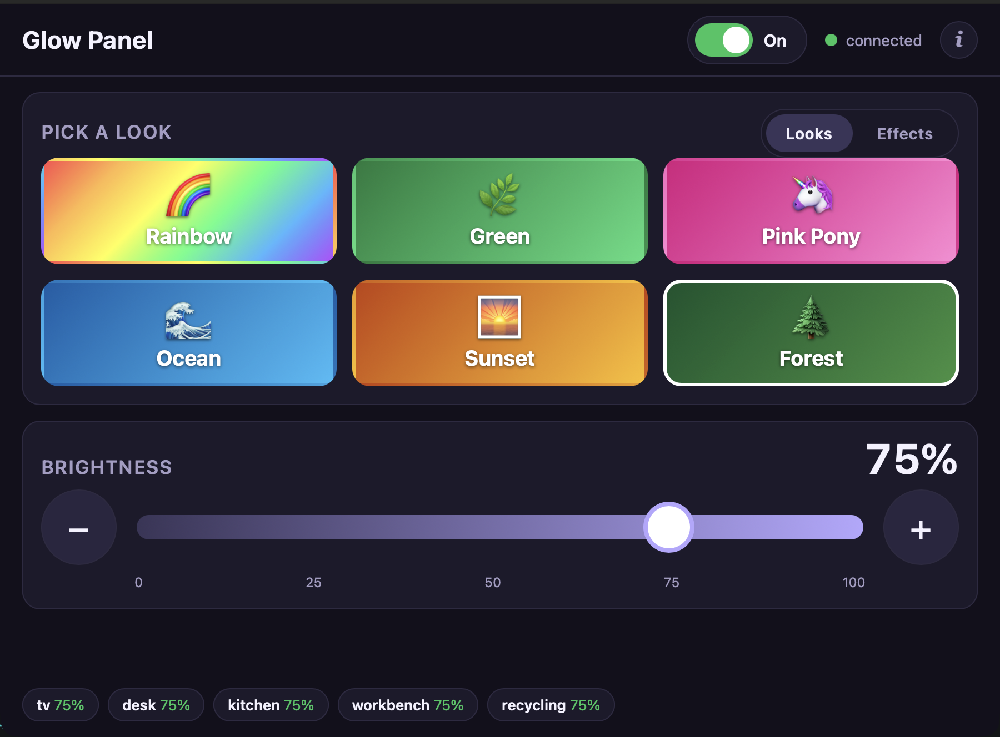

# GlowPanel

A Fyne desktop app for the [GlowKitchen](https://github.com/brennanMKE/GlowKitchen)
LED strips. Big brightness slider, big theme buttons — usable by a child without
instructions.

Does the same job as the `glow-*.sh` cron scripts, interactively.

Runs on Raspberry Pi 3B, Raspberry Pi OS 13 (trixie), arm64, under the labwc
Wayland session — and on macOS as a native `.app`.



## What it does

- **Six theme buttons** with colour and emoji, sized for small hands
- **Brightness** 0–100% in steps of 5, converted to the firmware's 0–225 scale
- **On / Off** as a switch in the header, next to the connection status
- **Live status** per strip, pushed from `lights/+/state` as the strips report

## Design notes

**Go-native UI.** Fyne draws the controls without embedding WebKitGTK, so the
Pi no longer starts separate web-content and network processes to render six
buttons and a slider. There is no npm, browser runtime or frontend build step.

**Event driven, not polled.** The strips publish to `lights/+/state` when they
change; the broker invokes a UI callback only when the cached view actually
differs, so an idle panel does no work. Two slow timers remain: a
local re-render every 60s to keep the "last seen" ages honest, and a `STATUS`
request every 5 minutes to pick up a strip that rebooted. Bringing the window
back into focus also asks for a report, throttled to one message per 15s.

**Background traffic never changes the lights.** The only thing GlowPanel
publishes unprompted is `STATUS` on `lights/all/cmd` — a read-only query, sent
with the retain flag off so nothing lingers on the broker for a device to replay
and act on when it reconnects. Themes, brightness and power go through
`Broker.Publish`, which is reached from a button press and nothing else.

**Shares `glow.conf`.** Config comes from `~/.config/glowkitchen/glow.conf` —
the same file the GlowKitchen `install.sh` already wrote for the cron scripts.
One broker address, one copy of the password, no drift. `config.go` parses the
small subset of shell syntax that file uses, including `DEVICES=(a b c)`.

**Fixed header, scrolling middle, fixed footer.** The window used to cut off the
bottom of the page at its default size. Now the header (title, power switch,
connection status) and the footer (status chips) are pinned, and only the middle
scrolls — so nothing can become unreachable however short the window gets. It
fits without scrolling at the default 900×660, and the theme grid wraps as the
window narrows.

Themes come first because they are what anyone walking up to the panel wants,
and pressing one also turns the strips on. Power went from a pair of 76px
buttons filling a panel at the bottom — the part that got cut off — to one
switch in the header.

**Pi graphics must be measured.** Fyne uses the Pi's graphics driver rather
than WebKitGTK's software-rendered web view. Test the build under labwc through
screen blank/wake cycles before deployment. If native Wayland is unstable,
launch through XWayland by unsetting `WAYLAND_DISPLAY` while keeping `DISPLAY`.

## Building

Build **on the Pi**. Fyne links to the platform graphics stack through CGO, so a
macOS-to-Linux build still needs an arm64 C cross-toolchain and graphics
headers. Building on the Pi is simpler.

```bash
scp -r glowpanel greenpi:~/
ssh greenpi 'cd ~/glowpanel && ./build-on-pi.sh && ./install-desktop.sh --desktop'
```

`build-on-pi.sh` installs Go, the compiler and the Mesa/X11/Wayland development
headers required by Fyne, resolves the Go modules, runs the full test suite and
builds `build/bin/glowpanel`. WebKitGTK is not a build or runtime dependency.

## Building for macOS

The Fyne command packages the already-built binary and app metadata into a
standard macOS bundle:

```bash
brew install go
go install fyne.io/tools/cmd/fyne@latest
go test ./...
fyne package -os darwin -release
```

Produces `Glow Panel.app`, using the identifier, version and icon from
`FyneApp.toml`. Drag it to `/Applications`.

The bundle identifier remains `com.brennanmke.glowpanel`.

### Signing

The locally packaged bundle is not ready for redistribution. That is fine for
a local build, but a downloaded or shared bundle needs Developer ID signing and
notarization.

It matters the moment you send it to anyone else — over AirDrop, a download, or
a DMG — at which point it needs Developer ID signing and notarization or the
recipient gets "unidentified developer".

### Configuration on macOS

The Mac has no `glow.conf` by default. The app falls back to environment
variables (`MQTT_PASSWORD`, `MQTT_USER`, `GLOW_BROKER`, `GLOW_PORT`,
`GLOW_DEVICES`), which covers launching from a terminal.

**A Finder-launched app bundle does not inherit your shell environment**, so for
double-click launching you need a real config file:

```bash
mkdir -p ~/.config/glowkitchen && chmod 700 ~/.config/glowkitchen
cat > ~/.config/glowkitchen/glow.conf <<'EOF'
BROKER="your.broker.address"
PORT="1883"
MQTT_USER="mqtt"
MQTT_PASSWORD="your-password"
DEVICES=(tv desk kitchen workbench recycling)
EOF
chmod 600 ~/.config/glowkitchen/glow.conf
```

Reaching the broker from outside the space relies on a Tailscale subnet router
advertising the network the broker sits on. That is what makes the Mac app
usable remotely.

### macOS footprint

Measure the Fyne port before recording a new baseline. The old Wails build was
about 105 MB resident on macOS.

## Desktop integration

There is no app bundle on Linux. `install-desktop.sh` places the three separate
pieces that together make a double-clickable app:

| Piece | Path |
|---|---|
| Executable | `/usr/local/bin/glowpanel` |
| Icon | `/usr/share/icons/hicolor/256x256/apps/glowpanel.png` |
| Launcher | `/usr/share/applications/glowpanel.desktop` |
| Desktop copy | `~/Desktop/glowpanel.desktop` (with `--desktop`) |

### The launcher must NOT be executable

This is the opposite of GNOME/Nautilus, where a desktop launcher must be
executable and carry `metadata::trusted`. Raspberry Pi OS draws the desktop with
**pcmanfm**, and libfm treats an executable file as a script — double-clicking
it opens an *"Execute / Execute in Terminal / Open"* dialog instead of launching
the app. Every stock launcher in `/usr/share/applications` is mode 644, and so
is this one.

Two further details if the dialog ever comes back:

- **pcmanfm caches file info.** A `chmod` on a launcher is not picked up by a
  running desktop; restart it or log out.
- **`quick_exec=1`** in `~/.config/libfm/libfm.conf` suppresses the dialog for
  all executables. Both Pis have it set. pcmanfm rewrites that file from memory
  on a clean exit, so edit it while pcmanfm is stopped or the change is lost.

### Emoji font

Raspberry Pi OS ships no emoji font, so the theme buttons render as tofu boxes
(▯) until one is installed:

```bash
sudo apt install fonts-noto-color-emoji
```

Fontconfig is read at process start, so relaunch the app afterwards.

## Deploying to a second Pi

No rebuild is needed for identical hardware and OS. The binary is dynamically
linked to the platform graphics libraries, which a matching Raspberry Pi OS
desktop normally already provides:

```bash
ssh rainbowpi 'sudo apt install -y fonts-noto-color-emoji'
scp greenpi:~/glowpanel/build/bin/glowpanel rainbowpi:~/glowpanel/build/bin/
scp install-desktop.sh glowpanel.desktop rainbowpi:~/glowpanel/
ssh rainbowpi 'cd ~/glowpanel && ./install-desktop.sh --desktop'
ssh rainbowpi 'ldd /usr/local/bin/glowpanel | grep "not found" || echo ok'
```

Build on the **older** machine and run on the newer one if their package
versions have drifted. glibc and soname compatibility work forward, not
backward.

## Running

Launched from the menu or the desktop icon it inherits the session environment.
Over SSH there is none, so it has to be supplied:

```bash
ssh greenpi 'XDG_RUNTIME_DIR=/run/user/1000 WAYLAND_DISPLAY=wayland-0 NO_AT_BRIDGE=1 glowpanel'
```

To start it with the desktop, **append** to `~/.config/labwc/autostart` — that
file also carries the `swayidle` line for screen blanking, so do not replace it:

```
/usr/bin/lwrespawn /home/pi/glowpanel/build/bin/glowpanel &
```

## Previous Wails footprint

For comparison, the Wails version measured this on a Pi 3B immediately after
launch:

```
WebKitWebProcess      160.8 MB
glowpanel             151.4 MB
WebKitNetworkProcess   59.8 MB
TOTAL (RSS)           371.9 MB

available: 665 MB -> 598 MB   (-67 MB)
```

Those figures disagree because summed RSS double-counts shared pages. The ~67 MB
drop in available memory is the more meaningful baseline. Measure the Fyne build
with PSS (`/proc/<pid>/smaps_rollup`) and the change in `MemAvailable` under the
same desktop session before claiming the migration's savings.

The cron scripts keep working with the panel closed, so on a memory-tight Pi it
is reasonable to launch it on demand rather than autostart it.

## Behaviour worth knowing

Pressing a theme button also **turns the lights on**. The firmware re-enables a
disabled strip when it receives a theme — right for a big friendly button, but
it means the panel can override the 02:00 scheduled off. The next scheduled step
puts things back.

Brightness publishes with `RETAIN` from `glow.conf` (true by default), matching
the cron scripts, so a strip that reboots picks up the level it last received.

## Repository layout

| File | Purpose |
|---|---|
| `main.go` | Fyne window, controls, layout and status rendering |
| `app.go` | Application lifecycle, command methods and theme table |
| `mqtt.go` | paho client, publish, `lights/+/state` subscription and cache |
| `config.go` | `glow.conf` parser, percent ↔ 0–225 conversion |
| `build/appicon.png` | Source asset; icon theme on Linux, `.icns` on macOS |
| `FyneApp.toml` | Package name, version, bundle ID and icon |
| `build-on-pi.sh` | Dependencies, tests and release build |
| `install-desktop.sh` | Binary, icon, `.desktop` entry |
| `glowpanel.desktop` | Launcher definition |

This Mac checkout is the source of truth. `~/glowpanel` on greenpi is the build
directory — same source plus `build/bin/` and the Go module cache.
`~/glowpanel` on rainbowpi holds only a staged binary and the install scripts.

Edit here, `scp` to greenpi, rebuild, reinstall, and copy the binary onward.
