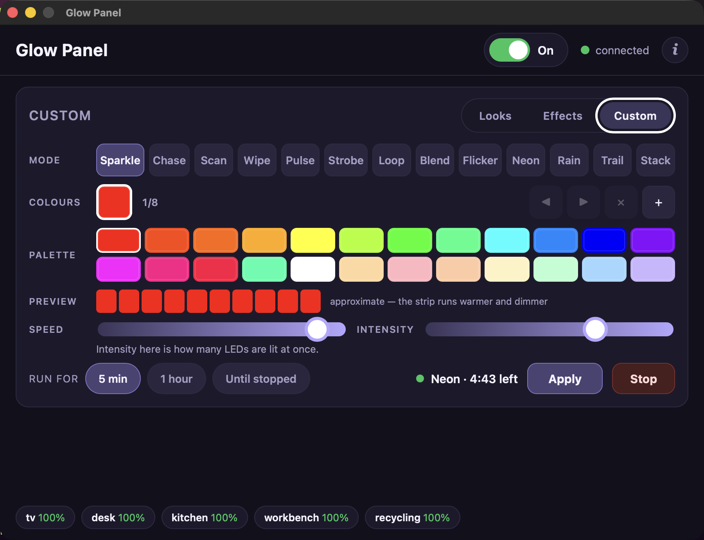

# GlowPanel

A Wails desktop app for the [GlowKitchen](https://github.com/brennanMKE/GlowKitchen)
LED strips. Big brightness slider, big theme buttons — usable by a child without
instructions.

Does the same job as the `glow-*.sh` cron scripts, interactively.

Runs on Raspberry Pi 3B, Raspberry Pi OS 13 (trixie), arm64, under the labwc
Wayland session — and on macOS as a native `.app`.


## What it does

- **Six theme buttons** with colour and emoji, sized for small hands
- **Nine effect presets** behind a Looks/Effects/Custom switch, with a duration
  and a Stop button
- **A custom effect builder** — any of the nine modes, one to eight colours from
  a built-in palette, and the speed and intensity sliders
- **Brightness** 0–100% in steps of 5, converted to the firmware's 0–225 scale
- **On / Off** as a switch in the header, next to the connection status
- **Live status** per strip, pushed from `lights/+/state` as the strips report

## Effects


A theme is a look the strips hold. An effect is something they *do* — it runs,
it can time out, and when it stops the strips go back to whatever theme was
showing. The firmware exposes them through one command, `SET_EFFECT:` followed
by a JSON body, and `CLEAR_EFFECT` to stop.

Two of the nine presets — Dolly and Cylon — are tuned defaults from
GlowKitchen's `scripts/demo_effect.sh`, copied into `effects.go` rather than
read from it, since a Pi that only has the binary has no copy of that script.
Each preset carries its mode, palette, speed and intensity; the panel adds the
timeout from the "Run for" row.

The other seven are ours:

| Preset | Mode | Reference |
|---|---|---|
| **Cyberpunk** 🐉 | Flicker | The dragon hoarding over the noodle bar in *Blade Runner* — cold blue neon with the red of its tongue through it, on Flicker because the sign is a tube that is never quite steady |
| **Pac-Man** 👻 | Chase | All four ghosts nose to tail, in [GlowGhosts](../../PlatformIO/GlowGhosts)' colours rather than the arcade's — see below |
| **Matrix** 🟩 | Rain | Digital rain — drops at their own rates and lengths, each a bright head over a fading tail |
| **Fifth Element** 🎤 | Neon | Ruby Rhod's leopard, gold and hot pink, lit at once and clashing on purpose |
| **Tron** 🏍️ | Trail | Two light cycles whose ribbons stay lit — the arena fills, then clears |
| **Tetris** 🧱 | Stack | Pieces fall, settle on what has already landed, and clear when the strip fills |
| **Phosphor** 💾 | Pulse | A P1 terminal idling — a nine-second breath that only dips to two thirds |

**Matrix is Chase, not Sparkle.** It was Sparkle to begin with, on the theory
that a glyph popping and fading is what rain is made of. That is the wrong half:
Sparkle spawns at `rng(0, numLeds)`, so it has no direction, and green twinkling
is not the Matrix. Chase is the only renderer that travels. Chase now paints one
run per palette colour, each trailing a fading tail, so this is two green streams
falling rather than one flat streak. Still not the real thing — faithful rain
wants many streams at *different* rates, and Chase moves them in lockstep.

**Four renderers were added to the firmware** for these presets, because four
of them were being approximated by a mode that could not quite do the job.
`NEON` is Flicker indexed by LED position, so a palette lights at once in
different places instead of the whole strip turning one colour at a time — that
is what makes Fire fire. `RAIN` gives every drop its own rate and length, which
is the unevenness Chase cannot produce. `TRAIL` leaves a dim wall behind each
run until the lap wraps, where Chase's tail fades within a few LEDs. `STACK`
drops pieces that settle and accumulate. None needs a per-LED array: Rain keeps
eight drops in 32 bytes, and Stack derives every settled colour from how far up
the stack it sits, so the strip is its own record.

**Three presets depend on an earlier firmware change**: Chase used
to paint a single run and rotate its colour once per lap, so a four-colour
palette meant watching one colour cross, then the next. It now paints one run
per colour. That costs no new parameter — the palette already says how many runs
there are — and it is what makes Pac-Man four ghosts rather than one, Tron two
cycles rather than one, and Matrix a rainfall rather than a streak. Boards
running older firmware show the old single-run behaviour; nothing breaks.

**Pac-Man's ghosts are deeper than the arcade's.** Pinky `#FFB8FF` and Clyde
`#FFB851` carry so much white that a WS2812B renders them as pale lavender and
near-white — which is what they looked like on the strip. The GlowGhosts project
hit this on the same LEDs and settled on `#FF1E96` and `#FF4600`, so those are
what ship here rather than a second round of the same discovery.

They replaced the originals for Wipe, Chase, Flicker, Pulse, Strobe, Loop and
Blend, which were a tour of the nine renderers: one preset per mode, a colour or
two each, doing the plainest possible version of what that mode does. That is a
good way to demonstrate firmware and a poor way to fill a grid someone presses.
Picking the mode that serves the picture instead is why three presets are now
Chase, two are Sparkle, and nothing at all is left on Wipe — the builder still
reaches all nine modes, which is where the completeness belongs.

**Effects share the theme panel rather than taking a second screen.** The
brightness slider and the power switch stay reachable whichever grid is showing,
and there is no navigation for a child to get lost in. The running banner and
the Stop button also appear on the Looks tab while something is running, so
stopping an effect never requires finding the tab it was started from.

**Effects are never published retained**, whatever `RETAIN` says in `glow.conf`.
An effect is an event, not a configuration: a retained `SET_EFFECT` is replayed
to every device on every reconnect, and one carrying a timeout restarts its
countdown each time. This is not hypothetical — a retained `FOREST` sitting on
the broker used to snap a strip back to Forest seconds after every effect, and
survived reboots of the board and the broker both, because nothing was
publishing it. MQTT was replaying it. `SetTheme` used to hard-code the same
mistake and now follows the configured flag like brightness and power do.

**Everything is validated before it is sent.** The firmware answers a malformed
payload by changing nothing and publishing nothing — no error topic, no NACK,
the reason goes to its serial log alone. A rejection on the wire is
indistinguishable from a message that never arrived, so `buildEffectPayload`
checks the mode, the colour format, the 0–255 ranges and the 512-byte device
buffer first. `effects_test.go` runs every shipped preset through it.

**The countdown comes from the device, not from a local timer.** While an effect
is running the strip's `STATUS` reply gains a `custom` object with the mode and
the seconds remaining, and the panel polls for it every 5 seconds — the strip's
clock survives reboots the panel's would not. The displayed seconds tick locally
between polls purely so the number moves; every reply snaps it back. A `custom`
object is absent whenever the theme is not `Custom`, which means no effect
rather than an error.

**Strobe is capped at 60 seconds** even when "Until stopped" is selected. The
cap is on the mode rather than the preset, so the builder inherits it.

## The custom builder



The presets are nine points in a space the firmware opens up entirely: any of
the nine modes, any one to eight colours, any speed and intensity. The Custom
tab is that space, and it takes the whole middle of the page — six rows of
controls do not fit alongside the brightness panel at 900x660, so brightness
stands down while composing and comes back on the other two tabs.

Four rules are enforced in the UI because the firmware will not tell anyone they
were broken:

**One to eight colours, and nine is a rejection rather than a truncation.** The
whole command is discarded, the strip carries on doing exactly what it was
doing, and no MQTT reply of any kind is published. `+` stops at eight, `✕` stops
at one, and `SetCustomEffect` re-checks in Go — so a bug in the swatch row
surfaces as an error string rather than as lights that quietly do not change.

**Blend, Flicker and Loop are greyed out while the palette holds a pastel.**
Those three force saturation and value to full — Loop takes saturation from
`intensity` instead — so `#FFB6C1` comes out as vivid pink rather than the soft
pink in the picker. Rather than letting the firmware flatten a palette without
saying so, the modes go unavailable with a line explaining why. The palette's
top row is fully saturated and always safe; the bottom row is the pastels that
trigger this.

**Intensity means something different in every mode**, so the slider says which
— the width of a run in Chase and Scan, the depth of the breath in Pulse, how
much of each flash is on in Strobe, how deep each dip goes in Flicker. Blend
hard-codes its own value and ignores the field, so the slider is disabled for
that one and only it. Flicker was the other until the firmware gave it both
knobs — before that a Flicker effect was the same effect however it was
configured.

**The builder's speed slider is scaled to the shortest strip that has
reported.** The renderers were tuned for roughly 240 LEDs; on the 10-LED dev
board anything much above 140 crosses the whole strip in a fraction of a second
and reads as a flash. Since effects are broadcast to every strip at once, the
shortest one sets the ceiling.

**Presets ask for a crossing time instead, and the panel solves for the speed.**
Chase, Wipe and Scan advance one LED per tick, so the firmware's `speed` is
milliseconds per LED and the strip's length decides how long a pass takes. Cylon
at a fixed speed 0 swept the 10-LED dev board in 1.0s and a 240-LED run in 24s —
correct on the bench, broken in the room. A scanner is recognised by its rate,
so Cylon now states one (`TraverseMs: 1100`, about what the Knight Rider and
Cylon scanners actually move at) and `resolveSpeed` inverts the firmware's
`speedInterval` against the lengths the strips reported. A sweep is now roughly
1.1s at 30, 60, 144, 240 and 300 LEDs alike. Portal, Tron and Pac-Man state
their own rates the same way.

Short strips are the exception, and it is the firmware's floor rather than this
code: Chase cannot tick slower than 40ms, so a 60-LED strip laps in 2.4s however
long Pac-Man asks for. Nothing can be done about that from the panel.

The rate is solved for the *longest* strip, since the long ones are what a fixed
speed leaves crawling, and then held back so the *shortest* never crosses faster
than 400ms — a mixed fleet cannot have both from one broadcast byte. Note this
does not reuse the slider's ceiling: that ceiling rises linearly with length and
held a 60-LED strip to a 2.3s sweep when 1.1s was both asked for and perfectly
readable. It is the right guard for a slider the user can drag anywhere, and the
wrong one for a preset that has already said how fast it wants to cross.

Order matters in six of the nine modes — the palette is the animation's
sequence, not just its ingredients — so swatches can be moved with ◀ and ▶.
Sparkle is the exception: it lays colours out by LED position, which is why it
is the one mode whose preview is a fair likeness rather than a single frame of
something moving. The preview is an approximation twice over, and says so: the
device converts through HSV and back with FastLED's `hsv2rgb_rainbow()`, which
warps hue deliberately, so the strip runs warmer and dimmer than the swatches.

**Colours come from a built-in palette, not `<input type="color">`.** That input
hands back `#rrggbb` with no conversion, which is tempting, but it delegates the
interaction to the OS: a desktop colour chooser dialog, on a Pi's small
touchscreen, under labwc, with no keyboard. A fixed grid of large targets is the
thing that actually works on the hardware this runs on. The cost is that an
arbitrary hex value is out of reach; saving palettes by name is the obvious next
step and is not built yet.

See `docs/glowpanel_effects_integration.md` in the GlowKitchen repo for the
command reference and the firmware-side details.

## Design notes

**No npm.** The frontend is plain HTML/CSS/JS. Wails injects its Go bindings on
`window.go.main.App`, so no bundler is needed. A Vite build is the step most
likely to fail in the Pi's ~600 MB of free RAM, so it is simply not there.

**Event driven, not polled.** The strips publish to `lights/+/state` when they
change; the Go side pushes a `status` event at the frontend only when the cached
view actually differs, so an idle panel does no work. Three timers remain: a
local re-render every 60s to keep the "last seen" ages honest, a `STATUS`
request every 5 minutes to pick up a strip that rebooted, and — only while an
effect is counting down — a `STATUS` request every 5s to keep the banner's
remaining seconds honest. Bringing the window back into focus also asks for a
report, throttled to one message per 15s.

**Background traffic never changes the lights.** The only thing GlowPanel
publishes unprompted is `STATUS` — a read-only query, sent with the retain flag
off so nothing lingers on the broker for a device to replay and act on when it
reconnects. Themes, brightness, power and effects go through `Broker.Publish`,
which is reached from a button press and nothing else.

**One message, not one per device.** Everything goes to `lights/all/cmd`, which
every strip subscribes to. `Broker.Publish` used to loop over the names in
`glow.conf` and send an identical copy to each — five times the traffic, and
silent towards any strip the config did not happen to list, such as one being
staged onto new firmware. `DEVICES` now only decides which strips get a status
chip in the footer.

One wrinkle comes with it: a strip running an effect ignores a *theme* arriving
on the broadcast topic, because device state wins over a fleet-wide command
(GlowKitchen issue #0020). Pressing a theme button is how anyone gets out of an
effect without hunting for Stop, so `SetTheme` sends `CLEAR_EFFECT` first when
something is running.

**Shares `glow.conf`.** Config comes from `~/.config/glowkitchen/glow.conf` —
the same file the GlowKitchen `install.sh` already wrote for the cron scripts.
One broker address, one copy of the password, no drift. `config.go` parses the
small subset of shell syntax that file uses, including `DEVICES=(a b c)`.

**Fixed header, scrolling middle, fixed footer.** The window used to cut off the
bottom of the page at its default size. Now the header (title, power switch,
connection status) and the footer (status chips) are pinned, and only the middle
scrolls — so nothing can become unreachable however short the window gets. It
fits without scrolling at the default 900×660 and down to about 480px tall,
where a media query shrinks the theme buttons rather than adding a scrollbar.

Themes come first because they are what anyone walking up to the panel wants,
and pressing one also turns the strips on. Power went from a pair of 76px
buttons filling a panel at the bottom — the part that got cut off — to one
switch in the header.

**GPU disabled deliberately.** `WebviewGpuPolicyNever` in `main.go`: the Pi 3B's
VideoCore IV gives WebKitGTK nothing useful, and requesting acceleration causes
flicker and occasional blank surfaces under labwc. It falls back to software
rendering and logs a GL warning on startup, which is expected.

## Building

Build **on the Pi**. Wails links against WebKitGTK through CGO, so a
`GOOS=linux GOARCH=arm64` build from macOS needs a full cross toolchain plus
arm64 webkit headers — not worth the trouble when Go compiles fine on the Pi.

```bash
scp -r glowpanel greenpi:~/
ssh greenpi 'cd ~/glowpanel && ./build-on-pi.sh && ./install-desktop.sh --desktop'
```

`build-on-pi.sh` installs `golang-go`, `libwebkit2gtk-4.1-dev` and friends,
fetches the Wails CLI, and builds. First run pulls roughly 300 MB and takes
several minutes on an A53; later builds are fast.

The one non-obvious flag:

```bash
wails build -tags webkit2_41
```

Debian 13 ships **only** the WebKitGTK 4.1 API — there is no
`libwebkit2gtk-4.0-37` package at all. Wails v2 defaults to 4.0, so without this
tag the build fails on a missing dependency.

## Building for macOS

Unlike the Pi build, this one is straightforward — macOS uses the system
WKWebView, so there is no CGO/webkit dependency to wrestle with.

```bash
brew install go
go install github.com/wailsapp/wails/v2/cmd/wails@v2.13.0
wails build -platform darwin/arm64 -ldflags "-X 'main.gitRevision=$(git rev-parse --short HEAD)'"
mv build/bin/glowpanel.app "build/bin/Glow Panel.app"   # nicer name in Finder
```

The `-ldflags` stamp is what puts a commit in the About view. Wails builds with
`-trimpath` and strips the VCS information Go would otherwise embed, so without
it the dialog can only report a version that rarely changes. Omitting the flag
is harmless — the Revision row is simply left out.

Produces a real bundle at `build/bin/Glow Panel.app` — 8.7 MB, arm64, with
`build/appicon.png` converted to `iconfile.icns`. Drag it to `/Applications`.

Bundle metadata lives in `build/darwin/Info.plist`; the bundle identifier is
`com.brennanmke.glowpanel`. `CFBundleName` and `CFBundleDisplayName` both come
from `productName` in `wails.json`, so the menu bar reads **Glow Panel** while
the binary, the repo and the bundle ID stay `glowpanel`.

### Signing

Wails ad-hoc signs the bundle, so `spctl` reports **rejected** and it has no
Team ID. That is fine for a locally built app: Gatekeeper only blocks bundles
carrying a `com.apple.quarantine` attribute, which downloads get and local
builds do not.

It matters the moment you send it to anyone else — over AirDrop, a download, or
a DMG — at which point it needs Developer ID signing and notarization or the
recipient gets "unidentified developer".

### Configuration on macOS

The Mac has no `glow.conf` by default. The app falls back to environment
variables (`MQTT_PASSWORD`, `MQTT_USER`, `GLOW_BROKER`, `GLOW_PORT`,
`GLOW_DEVICES`), which covers launching from a terminal.

**A Finder-launched app bundle does not inherit your shell environment**, so for
double-click launching you need a real config file:

```bash
mkdir -p ~/.config/glowkitchen && chmod 700 ~/.config/glowkitchen
cat > ~/.config/glowkitchen/glow.conf <<'EOF'
BROKER="your.broker.address"
PORT="1883"
MQTT_USER="mqtt"
MQTT_PASSWORD="your-password"
DEVICES=(tv desk kitchen workbench recycling)
EOF
chmod 600 ~/.config/glowkitchen/glow.conf
```

Reaching the broker from outside the space relies on a Tailscale subnet router
advertising the network the broker sits on. That is what makes the Mac app
usable remotely.

### macOS footprint

~105 MB resident, against ~372 MB summed RSS on the Pi. WKWebView is provided by
the system and shared, so there is no bundled engine and no separate WebKit
processes counted against the app.

## Desktop integration

There is no app bundle on Linux. `install-desktop.sh` places the three separate
pieces that together make a double-clickable app:

| Piece | Path |
|---|---|
| Executable | `/usr/local/bin/glowpanel` |
| Icon | `/usr/share/icons/hicolor/256x256/apps/glowpanel.png` |
| Launcher | `/usr/share/applications/glowpanel.desktop` |
| Desktop copy | `~/Desktop/glowpanel.desktop` (with `--desktop`) |

### The launcher must NOT be executable

This is the opposite of GNOME/Nautilus, where a desktop launcher must be
executable and carry `metadata::trusted`. Raspberry Pi OS draws the desktop with
**pcmanfm**, and libfm treats an executable file as a script — double-clicking
it opens an *"Execute / Execute in Terminal / Open"* dialog instead of launching
the app. Every stock launcher in `/usr/share/applications` is mode 644, and so
is this one.

Two further details if the dialog ever comes back:

- **pcmanfm caches file info.** A `chmod` on a launcher is not picked up by a
  running desktop; restart it or log out.
- **`quick_exec=1`** in `~/.config/libfm/libfm.conf` suppresses the dialog for
  all executables. Both Pis have it set. pcmanfm rewrites that file from memory
  on a clean exit, so edit it while pcmanfm is stopped or the change is lost.

### Emoji font

Raspberry Pi OS ships no emoji font, so the theme buttons render as tofu boxes
(▯) until one is installed:

```bash
sudo apt install fonts-noto-color-emoji
```

Fontconfig is read at process start, so relaunch the app afterwards.

## Deploying to a second Pi

No rebuild needed for identical hardware and OS. The binary is dynamically
linked, so the target needs the WebKit **runtime** — not the ~300 MB dev
toolchain:

```bash
ssh rainbowpi 'sudo apt install -y libwebkit2gtk-4.1-0 fonts-noto-color-emoji'
scp greenpi:~/glowpanel/build/bin/glowpanel rainbowpi:~/glowpanel/build/bin/
scp install-desktop.sh glowpanel.desktop rainbowpi:~/glowpanel/
ssh rainbowpi 'cd ~/glowpanel && ./install-desktop.sh --desktop'
ssh rainbowpi 'ldd /usr/local/bin/glowpanel | grep "not found" || echo ok'
```

Build on the **older** machine and run on the newer one if their package
versions have drifted. glibc and soname compatibility work forward, not
backward.

## Running

Launched from the menu or the desktop icon it inherits the session environment.
Over SSH there is none, so it has to be supplied:

```bash
ssh greenpi 'XDG_RUNTIME_DIR=/run/user/1000 WAYLAND_DISPLAY=wayland-0 NO_AT_BRIDGE=1 glowpanel'
```

To start it with the desktop, **append** to `~/.config/labwc/autostart` — that
file also carries the `swayidle` line for screen blanking, so do not replace it:

```
/usr/bin/lwrespawn /home/pi/glowpanel/build/bin/glowpanel &
```

## Measured footprint

On a Pi 3B, idle, immediately after launch:

```
WebKitWebProcess      160.8 MB
glowpanel             151.4 MB
WebKitNetworkProcess   59.8 MB
TOTAL (RSS)           371.9 MB

available: 665 MB -> 598 MB   (-67 MB)
```

Those figures disagree because summed RSS double-counts pages shared between
the three processes. The ~67 MB drop in available memory is the genuinely
unavailable portion; most of the remainder is file-backed library code the
kernel can reclaim under pressure. Budget somewhere between the two, and expect
the WebProcess to grow under sustained use.

The cron scripts keep working with the panel closed, so on a memory-tight Pi it
is reasonable to launch it on demand rather than autostart it.

## Behaviour worth knowing

Pressing a theme button also **turns the lights on**. The firmware re-enables a
disabled strip when it receives a theme — right for a big friendly button, but
it means the panel can override the 02:00 scheduled off. The next scheduled step
puts things back.

Brightness publishes with `RETAIN` from `glow.conf` (true by default), matching
the cron scripts, so a strip that reboots picks up the level it last received.

## Repository layout

| File | Purpose |
|---|---|
| `main.go` | Wails setup, window options, Linux GPU policy |
| `app.go` | Methods bound to the frontend; theme table |
| `mqtt.go` | paho client, publish, `lights/+/state` subscription and cache |
| `config.go` | `glow.conf` parser, percent ↔ 0–225 conversion |
| `frontend/dist/` | `index.html`, `style.css`, `app.js` — no build step |
| `build/appicon.png` | Source asset; icon theme on Linux, `.icns` on macOS |
| `build/darwin/` | macOS bundle metadata (`Info.plist`) |
| `build-on-pi.sh` | Dependencies, Wails CLI, build |
| `install-desktop.sh` | Binary, icon, `.desktop` entry |
| `glowpanel.desktop` | Launcher definition |

This Mac checkout is the source of truth. `~/glowpanel` on greenpi is the build
directory — same source plus `build/bin/`, the Go module cache, and the Wails
CLI. `~/glowpanel` on rainbowpi holds only a staged binary and the install
scripts.

Edit here, `scp` to greenpi, rebuild, reinstall, copy the binary onward.
Anything under `frontend/dist/` needs a rebuild too, since `go:embed` compiles
it into the binary.
